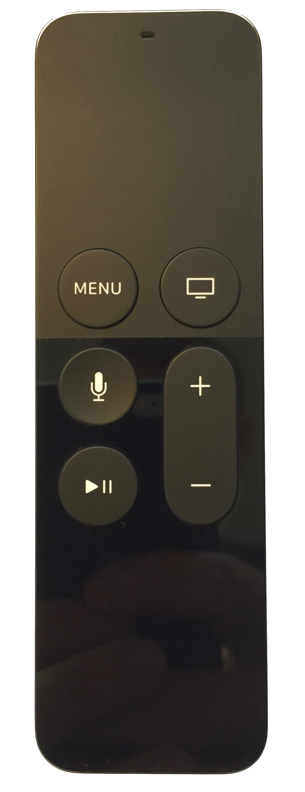
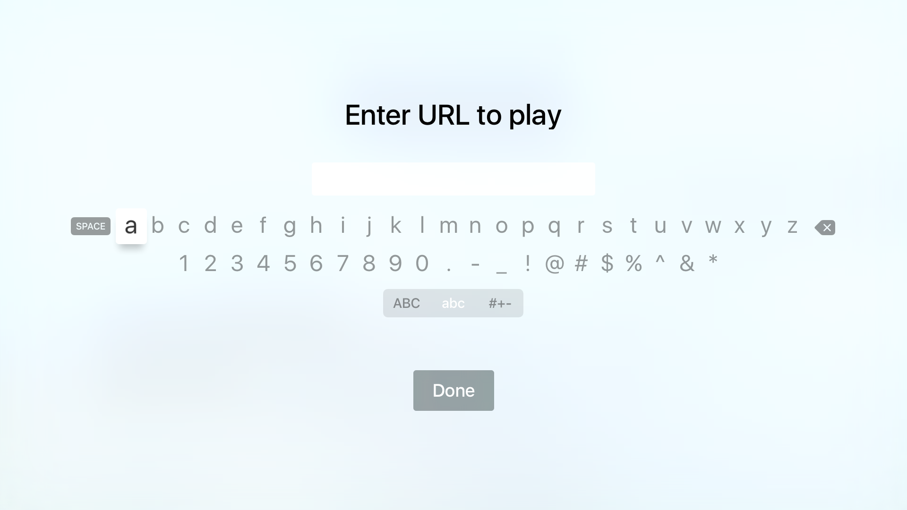
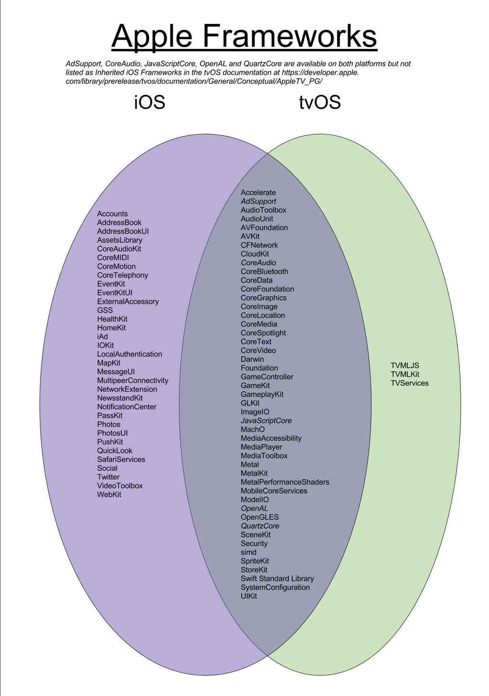
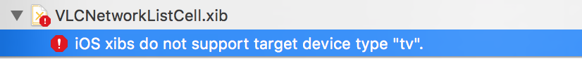

###CocoaHeads Hamburg<br>November 5th 2015
# [fit] Intro to tvOS
###Tobias Conradi<br>@toco91

---


# [fit] iOS
# [fit] watchOS
# [fit] tvOS

---

# [fit] yet another platform
# [fit]based on iOS

---

# [fit] _Familiar_ if you know iOS

---

# [fit] But _not_ the same

---

## [fit] No direct input

---
#[fit] Typing sucks!
#[fit] Design for _~~no~~_ reduced typing

---


---
# Don't let the user 'type' passwords
- Share authentification tokens via iCloud keychain if possible.

<br>

- Let the user only enter the username/email.
- Show a code which must be entered on the website or in iOS app.

---



#[fit] Not all Frameworks

####  @DaviOlesch [twitter.com/DavidOlesch/status/656152648433799168](https://twitter.com/DavidOlesch/status/656152648433799168)

---

#[fit] No (persistent) local storage.

---

- Maximum app size 200 MB.
- 500 KB persisten local storage (NSUserDefaults).
- Store persistent data in iCloud.
- Use on-demand resources for read-only app resources.
- Cached data might be deleted when the app ist not running. 

---

> ~~iPad~~ tvOS Apps shouldn't be just scaled up ~~iPhone~~ iPad Apps.

---
#Can't reuse XIBs


---

# [fit] Focus
---
The user moves the focus around using a remote:

Siri Remote
IR Remote
Game Controller

---

##Focus directions
Up
 Left           Right
Down

Next
Previous

---

##UIFocusEnvironment Protocol

---

- `preferredFocusedView: UIView?`
- `setNeedsFocusUpdate`
- `updateFocusIfNeeded`
- `shouldUpdateFocusInContext(context: UIFocusUpdateContext) -> Bool`
- `didUpdateFocusInContext(context: UIFocusUpdateContext, withAnimationCoordinator coordinator: UIFocusAnimationCoordinator)`

---
## UIFocusEnvironment
- UIView
- UIViewController
- UIWindow
- UIPresentationController

---

#Focus Guide
- Invisible guide
- Redirects focus to a view

---

#Focus Debugging
```objc
-[UIView _whyIsThisViewNotFocusable]
```
<br>

break on:

```swift
UIFocusEnvironment.shouldUpdateFocusInContext()
UIFocusEnvironment.didUpdateFocusInContext(withAnimationCoordinator:)
```
QuickLook on "context"

---

#[fit] Demo
#[fit] Focus
[github.com/toco/Intro-to-tvOS](https://github.com/toco/Intro-to-tvOS)

---

#User Input
- Manual event handling rarely needed when using default UI elements.
- UITapGestureRecognizer for button presses.
- UIGestureRecoginzer.allowedPressTypes

---
# UIPress
- Button presses are represented by UIPress.
- New UIResponder methods for UIPress similar to UITouch.

<br>

- No public API to differenciate between hardware button presses and synthesized presses (arrows).
- Private property 'isSynthetic' (Use at your own risk).

---
#UIPress
- Arrows: Up, Down, Left, Right
- Select
- Menu
- PlayPause 

---

# Touch tracking
- Touch position always begins in the center of the view.
- Absolute postion on trackpad not accessible with public API.
- UIEvent has private 'digitizerLocation' (Use at your own risk).
- GameController API might be a better public option.

---

#[fit]Demo 
#[fit]touches and presses
[github.com/toco/Intro-to-tvOS](https://github.com/toco/Intro-to-tvOS)

---

#Resources

- [developer.apple.com/tvos/human-interface-guidelines/](https://developer.apple.com/tvos/human-interface-guidelines/)
- [speakerdeck.com/neonichu/bring-your-apps-to-the-big-screen](https://speakerdeck.com/neonichu/bring-your-apps-to-the-big-screen)
- "Ich glotz TV", @avbelow, Macoun 2015
- [eternalstorms.wordpress.com/2015/10/05/pair-the-apple-tv-developer-kit-siri-remote-with-xcodes-simulator/](https://eternalstorms.wordpress.com/2015/10/05/pair-the-apple-tv-developer-kit-siri-remote-with-xcodes-simulator/)


--- 


# We are ~~hiring~~ looking for contributers.


---


#[fit]VLC for iOS

- approx. 13000 daily downloads
- 11.1M downloads since Juli 2013 (- 4 month not in App Store)

<br>

Want to contribute?

- [videolan.org/developers/](http://www.videolan.org/developers/)
- @feepk, @toco91

---

#[fit] Questions?
